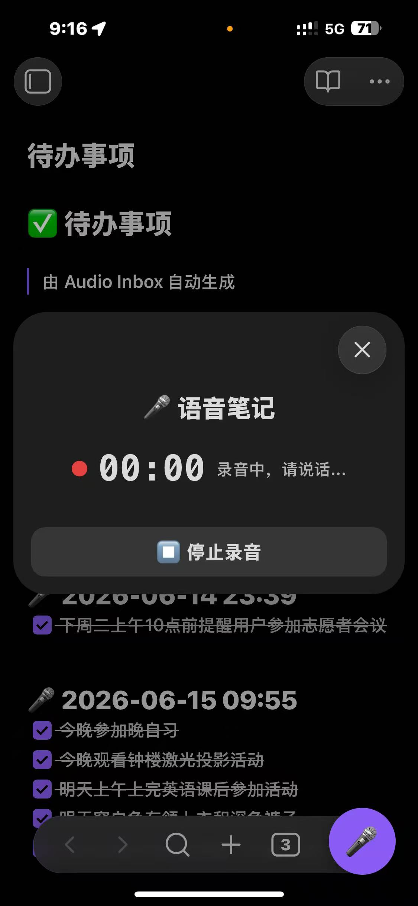
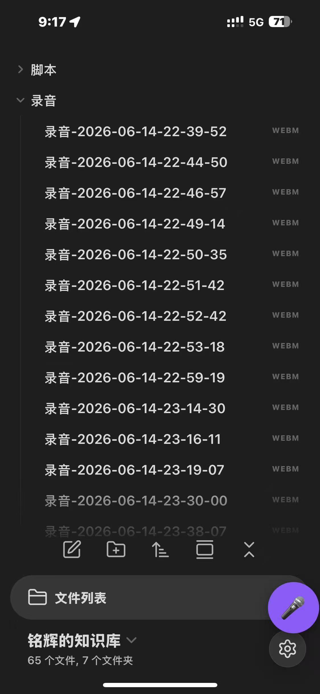
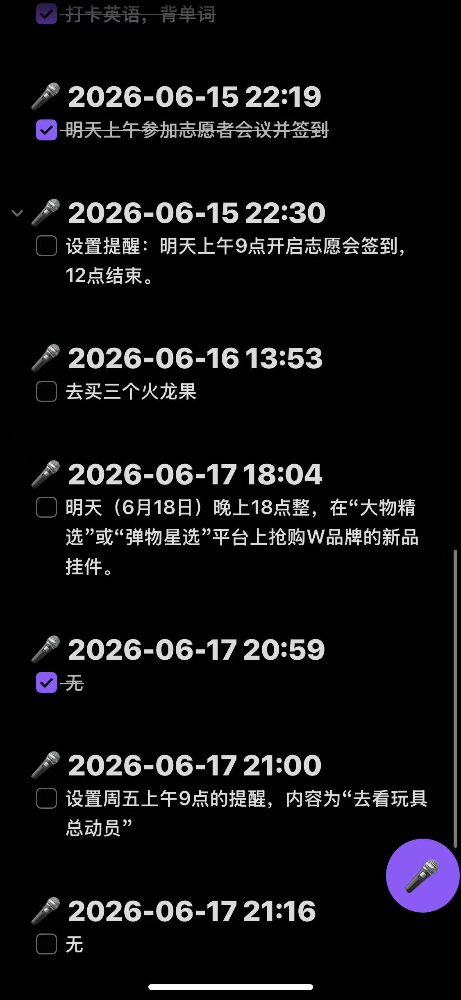
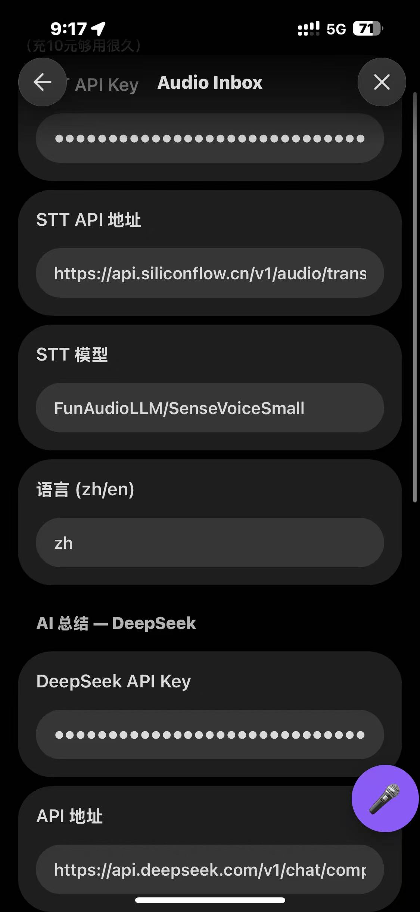
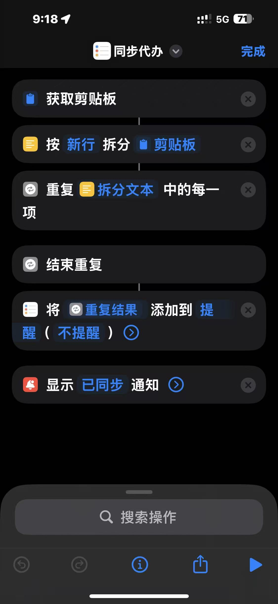

# 🎤 Audio Inbox — Obsidian Voice Note Plugin

> **One-click voice recording → Speech-to-Text → AI summarization**
> Desktop & Mobile, minimal setup, Chinese-first.

[](https://obsidian.md/plugins?id=audio-inbox)
[](https://github.com/andsea007/obsidian-audio-inbox/releases)
[](LICENSE)

> ⭐ **如果这个插件对你有帮助，请给个 Star 支持一下！**

---

## ✨ Features

### 🆚 Why Audio Inbox?

| | Audio Inbox | Other voice plugins |
|---|---|---|
| 🌐 **No VPN needed** | ✅ SiliconFlow + DeepSeek (国内) | ❌ OpenAI / Google |
| 💰 **Free STT** | ✅ SiliconFlow 免费额度 | ❌ 需付费 API |
| 📱 **Mobile recording** | ✅ 可拖动悬浮按钮 | ❌ 仅命令面板 |
| 🍎 **Reminders sync** | ✅ iOS 快捷指令联动 | ❌ 不支持 |
| 💭 **Memo Mode** | ✅ AI 自动区分提醒/备忘 | ❌ 仅待办 |
| 🎯 **One-click flow** | ✅ 录音→转写→总结 一条龙 | ⚠️ 多步操作 |

### 📋 All Features

| Feature | Description |
|---|---|
| 🎙️ **One-click Recording** | Click the mic icon → speak → stop → done. No extra steps. |
| 🧠 **Smart Transcription** | Powered by SiliconFlow SenseVoiceSmall (free tier, works in China without VPN) |
| 🤖 **AI Summarization** | DeepSeek automatically generates structured notes with summary & to-do list |
| 📱 **Mobile Support** | Draggable floating action button on iOS/Android, fully functional |
| 💭 **Memo Mode** | AI intelligently classifies recordings as reminders or memos. Memos are saved by date (`备忘录-2026-07-01.md`) with both AI summary and original transcript — easy to browse, never too long. |
| ✅ **Todo Extraction** | Auto-extracts `- [ ]` items from AI summary into a dedicated todo file |
| 🍎 **Apple Reminders Sync** | Exports clean todo list for iOS Shortcuts integration |
| 📂 **Batch Processing** | Process pre-recorded audio files in your inbox folder |
| 🌐 **China-Friendly** | No Google APIs, no VPN required. SiliconFlow + DeepSeek, both domestic services |

## 📸 Screenshots

| 录音界面 | 移动端悬浮按钮 | 生成的笔记 |
|---|---|---|
|  |  |  |

| 插件设置面板 | iOS 快捷指令联动 |
|---|
|  |  |

> 📸 **如何截图？** 在电脑上打开 Obsidian → 录音/查看笔记 → 用 `Win+Shift+S` 截取 → 保存为 PNG → 放到 `screenshots/` 文件夹 → 推送到 GitHub。手机上可以用音量键+电源键截图。

## 🚀 Quick Start

### Prerequisites

You need **two API keys** (both are domestic China services, no VPN needed):

1. **SiliconFlow API Key** (for Speech-to-Text) — Free tier available, [sign up here](https://cloud.siliconflow.cn/)
2. **DeepSeek API Key** (for AI Summarization) — Very affordable, [sign up here](https://platform.deepseek.com/)

### Installation

#### Option A: Manual Install (Recommended for now)

1. Download the latest release from [GitHub Releases](https://github.com/andsea007/obsidian-audio-inbox/releases)
2. Extract into your vault: `<vault>/.obsidian/plugins/audio-inbox/`
3. Restart Obsidian → Settings → Community Plugins → Enable "Audio Inbox"

#### Option B: BRAT Plugin

1. Install [BRAT](https://github.com/TfTHacker/obsidian42-brat)
2. BRAT Settings → Add Beta Plugin → `andsea007/obsidian-audio-inbox`

### Configuration

1. Open Obsidian Settings → Audio Inbox
2. Paste your **SiliconFlow API Key** in the STT section
3. Paste your **DeepSeek API Key** in the AI section
4. You're ready to go! 🎉

## 📖 Usage

### Recording a Voice Note

- **Desktop**: Click the mic icon in the left ribbon
- **Mobile**: Tap the floating red button (drag it to reposition)
- **Command Palette**: `Ctrl/Cmd + P` → "开始语音笔记（录音）"

> ⏱️ **建议录音时长控制在 5 分钟以内**，以获得最佳的语音识别准确率和 AI 总结效果。过长的录音可能影响 STT 识别质量。

### Workflow

```
🎤 Click Record → 🗣️ Speak → ⏹ Stop → 🎧 STT → 🤖 AI Summarize → 📝 Note Saved
```

The generated note includes:

```markdown
# 🎤 语音笔记 — 2026-06-15 21:30

---

## 📋 总结
- Key points from your voice...

## ✅ 待办事项
- [ ] Task 1
- [ ] Task 2

---
*Audio Inbox 生成*
```

### Processing Pre-recorded Audio

If you have audio files (`.m4a`, `.mp3`, `.wav`, `.ogg`, `.webm`) in your inbox folder:

1. `Ctrl/Cmd + P` → "处理录音文件夹"
2. The plugin will batch-process all audio files

### iOS Shortcuts Integration

After each voice recording, the plugin copies your clean todo list to the clipboard. Create this iOS Shortcut to sync them to Apple Reminders:

| Step | Action | Setting |
|---|---|---|
| 1 | **Get Clipboard** | — |
| 2 | **Split Text** | By New Lines |
| 3 | **Repeat with Each** | — |
| ↳ | **Add New Reminder** | Title = Repeat Item |
| 4 | **Show Notification** | "✅ Synced" |

> 💡 Works on both desktop and mobile. After recording, run the Shortcut to import todos into Apple Reminders.

## ⚙️ Settings

| Setting | Default | Description |
|---|---|---|
| STT API Key | — | SiliconFlow API Key |
| STT API URL | `https://api.siliconflow.cn/v1/audio/transcriptions` | STT endpoint |
| STT Model | `FunAudioLLM/SenseVoiceSmall` | Speech recognition model |
| Language | `zh` | Language code (zh/en/ja/ko) |
| DeepSeek API Key | — | DeepSeek API Key |
| API URL | `https://api.deepseek.com/v1/chat/completions` | AI endpoint |
| Model | `deepseek-chat` | AI model |
| Summary Prompt | *(built-in)* | Customizable AI prompt |
| Recording Folder | `录音` | Where audio files are saved |
| Output Folder | `VoiceNotes` | Where notes are saved |
| Show Transcript | `false` | Include raw transcript in note |

## 🔧 Development

```bash
# Clone
git clone https://github.com/andsea007/obsidian-audio-inbox.git
cd obsidian-audio-inbox

# Install dependencies
npm install

# Dev mode (watch)
npm run dev

# Production build
npm run build
```

## 🤝 Contributing

Issues and Pull Requests are welcome!

1. Fork the repo
2. Create your feature branch: `git checkout -b feature/my-feature`
3. Commit: `git commit -m 'Add my feature'`
4. Push: `git push origin feature/my-feature`
5. Open a Pull Request

## 📄 License

[MIT](LICENSE)

---

<p align="center">
  Made with ❤️ by <a href="https://github.com/andsea007">Andsea</a>
</p>
